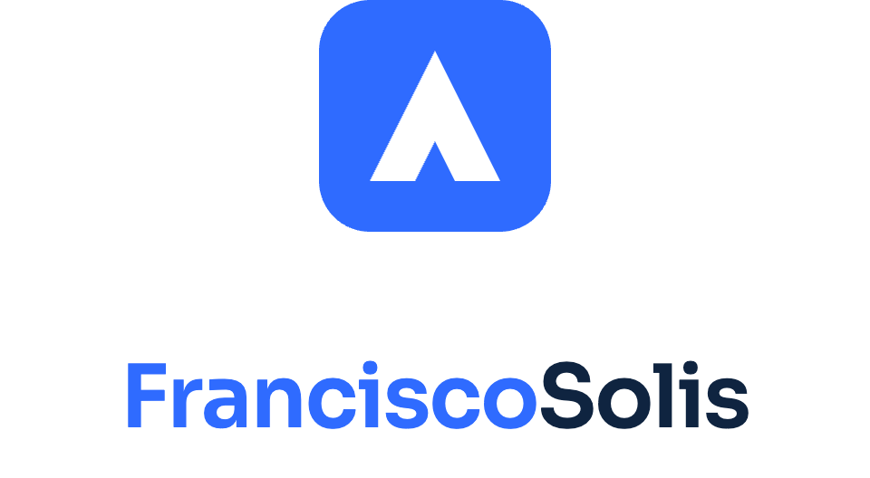

# FranciscoSolis — Brand Mark

B2B software for businesses of every size: appointments, quotes, signatures, and change requests. The brand is trusted, precise, and intelligent — enterprise-ready without feeling cold.

## Why it looks like this

The mark and choices each carry a meaning tied to what the company does:

**The peak.** An upward triangle with a notch cut from its base — three readings at once: the initial
A-like apex of a summit (growth, ambition of the businesses you serve), a checkmark-adjacent
silhouette (approval — quotes signed, appointments confirmed), and a subtle FS ligature reduced to
pure geometry. Solid fill = certainty; nothing decorative.

**The blue tile.** A rounded square is the most "software" of shapes — an app icon by construction.
Blue `#2f6bff` is the trust color of B2B, but pushed brighter than corporate navy so it reads
intelligent and current, not bureaucratic.

**The two-tone wordmark.** "Francisco" in accent blue, "Solis" in ink navy — one name, two words made
legible without a space or hyphen. The color split does the job punctuation would, which mirrors the
product philosophy: structure without friction.

**Sora SemiBold.** A geometric sans with slightly humanist curves — precise letterforms
(enterprise-ready) that avoid the coldness of stricter grotesques (not overly corporate).

**The palette logic.** Ink navy `#0f2440` for authority, one bright accent for action, near-white
surfaces — the restraint itself signals "we handle serious business documents."

## Primary lockup

Peak mark on a blue tile + two-tone wordmark, set as one name: **FranciscoSolis** (no space, no hyphen).


On dark surfaces:


## Stacked variant

For square placements and social profiles.



## Mark

The mark alone is used for avatars, favicons, and app icons. Minimum size 16 px. A monochrome ink version exists for single-color contexts.


## Color

| Role | Hex |
|---|---|
| Accent blue (tile, "Francisco") | `#2f6bff` |
| Ink navy ("Solis", mono mark) | `#0f2440` |
| Dark surface | `#0b1626` |
| Light surface | `#f7f9fc` |

On dark surfaces, "Francisco" lightens to `#4d82ff` and "Solis" is white.

## Typography

Wordmark: **Sora SemiBold (600)**, letter-spacing −2%. Sora is used for the wordmark only; it does not need to be the product UI font.

## Clear space

Keep clear space equal to **half the mark's height** on all sides of any lockup.

## Don'ts

- Don't stretch or squash the mark
- Don't recolor the tile
- Don't rotate the mark
- Don't place on low-contrast backgrounds
- Don't separate the words or change the casing

## Assets

Vector sources live in `public/brand/`, raster exports in `public/brand/png/` (4×).

| File | Use |
|---|---|
| `fs-lockup-horizontal.svg` / `png/…png` | Website header, docs (light) |
| `fs-lockup-horizontal-dark.svg` / `png/…png` | Dark surfaces |
| `fs-lockup-stacked.svg` / `png/…png` | Square placements, social |
| `fs-mark.svg` / `png/…png` | Avatar, favicon, app icon |
| `fs-mark-mono.svg` / `png/…png` | Single-color / print |

Generated icons — `public/favicon.svg`, `public/favicon.ico`, `public/apple-touch-icon.png`,
`public/icon-192.png`, `public/icon-512.png`, `public/icon-maskable-512.png` — are rasterized from
the mark geometry by `scripts/generate-brand-icons.mjs`. Re-run `pnpm brand:icons` after any change
to the mark.

## Using the brand in this site

Do **not** hotlink the lockup SVGs from markup. They set the wordmark as SVG `<text>` in
`font-family="Sora, …"`, which resolves against locally installed fonts only — anywhere Sora is not
installed the lockup silently falls back to a system sans and the wordmark loses its shape and
metrics. The SVG lockups are for handoff (design tools, docs, third parties), not for the app shell.

In the app, use the React components in `src/components/brand/` instead. They compose the tile mark
as inline SVG with the wordmark as real text in the webfont-loaded Sora, so the lockup is selectable,
scales crisply, and stays a single accessible name for screen readers:

```tsx
import {BrandLockup, BrandMark} from "@/components/brand";

<BrandLockup tone="dark" />              {/* header lockup on the dark surface */}
<BrandLockup variant="stacked" />        {/* square placements */}
<BrandMark size={24} />                  {/* mark alone */}
<BrandMark mono size={24} />             {/* single-color ink mark */}
```

Both clamp the mark up to its 16 px minimum. Clear space is opt-in via `clearSpace`, because most
placements already sit inside a container whose padding meets or exceeds half the mark's height —
the header is one such case, and adding the padding there would double the gap.
